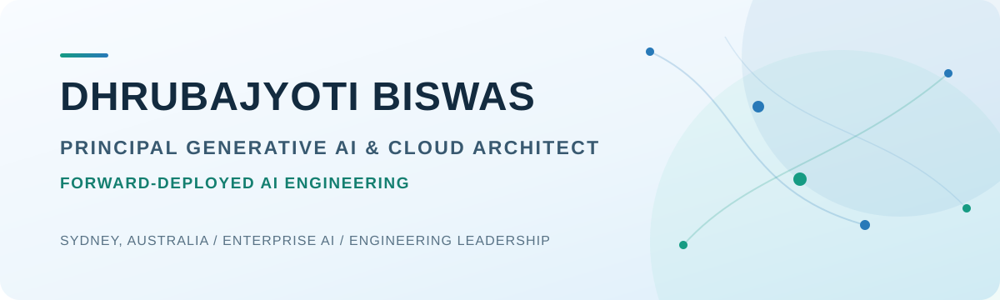

<picture>
  <source media="(prefers-color-scheme: dark)" srcset="./assets/profile-banner-dark.svg">
  <source media="(prefers-color-scheme: light)" srcset="./assets/profile-banner-light.svg">
  
</picture>

  <a href="https://dhrubdigital.works">Website</a> ·
  <a href="https://www.credly.com/users/dhrubajyoti-biswas">Credentials</a> ·
  <a href="#selected-systems">Featured work</a>

I lead engineering and architecture for enterprise AI, turning ambiguous problems into production-ready systems. Across **18+ years**, I have combined executive discovery, enterprise architecture, and hands-on delivery of agentic AI, RAG, cloud-native platforms, and repeatable adoption playbooks.

My experience spans public sector, SaaS, transportation, financial services, automotive, and technology.

> **Start here:** [explore construct.da](https://construct-da.vercel.app), a live, evidence-backed development-approval screening system for Australian residential projects.

## Impact at a glance

| Experience | Team leadership | Automation | Operations |
| :---: | :---: | :---: | :---: |
| **18+ years** | **12-person team** | **95%+** | **25% lower** |
| Engineering and architecture | Agentic RAG delivery | RCA report generation | Mean time to resolution |

Additional outcomes include **40% less manual support intervention** and **30% fewer customer escalations and reopened requests** through AI-assisted triage and knowledge retrieval.

## Selected systems

| Project | What it demonstrates |
| --- | --- |
| **[construct.da](https://github.com/dhrub-git/construct.da)** [Live demonstration](https://construct-da.vercel.app) | Evidence-backed development-approval screening for Australian residential projects. Document ingestion, OCR, spatial data, asynchronous workflows, and advisory reporting in a full-stack TypeScript application. |
| **[Mandate](https://github.com/dhrub-git/mandate.sh)** | Agentic AI assurance and policy generation with guided onboarding, LangGraph orchestration, web research, streaming progress, and deterministic EU AI Act risk classification. |
| **[Intelligent Briefing Notes](https://github.com/dhrub-git/briefing-notes)** | Architecture and implementation reference for durable, multi-party approval workflows using Temporal, including state transitions, retries, observability, testing, and operational scaling. |
| **[AI Security](https://github.com/dhrub-git/ai-security)** | Practical knowledge base covering AI governance, privacy, adversarial ML, model risk, security controls, and assurance frameworks. |

## Leadership and engineering focus

- **Forward-deployed AI:** customer discovery, workflow mapping, rapid prototyping, technical validation, and production handover
- **Reliable agentic systems:** RAG, tool use, multi-agent orchestration, evaluation, guardrails, observability, and human review
- **AI governance and assurance:** converting policies, risk frameworks, and regulatory requirements into practical engineering controls
- **Cloud and platform architecture:** OCI, AWS, Azure, Kubernetes, serverless, APIs, integrations, and event-driven systems
- **Engineering leadership:** creating clarity, raising technical standards, and enabling teams to deliver through ambiguity

## Technology landscape

`Python` `TypeScript` `JavaScript` `Java` `Go` `SQL` `React` `Next.js` `Spring Boot` `LangGraph` `LangChain` `Temporal` `PostgreSQL` `Kubernetes` `OCI` `AWS` `Azure`

## Operating principles

1. Start with the user workflow and a measurable outcome.
2. Make assumptions, constraints, and failure modes explicit.
3. Build the smallest working system that can prove or disprove value.
4. Instrument quality, reliability, cost, and adoption.
5. Turn repeated delivery patterns into capabilities other teams can reuse.

---

  <strong>Enterprise AI · Forward-Deployed Engineering · Architecture · Delivery Leadership</strong>

